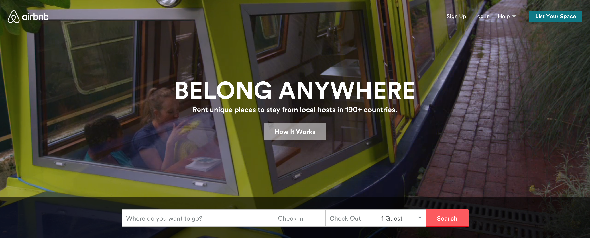
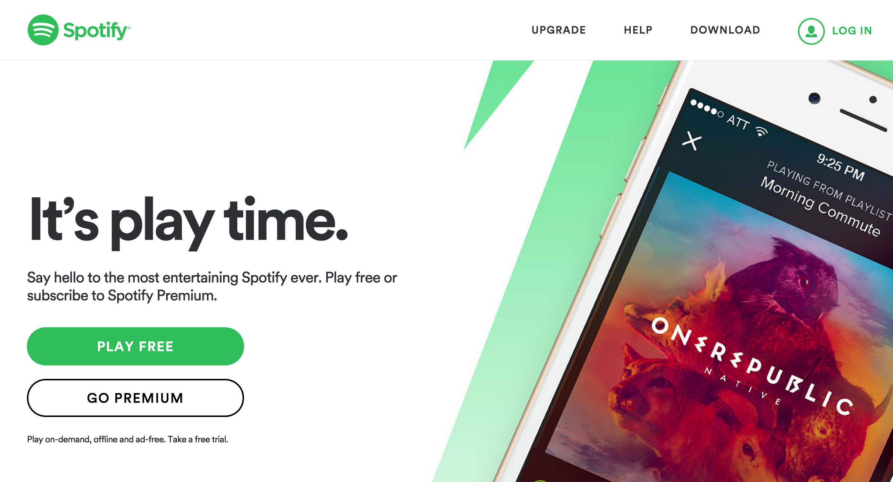
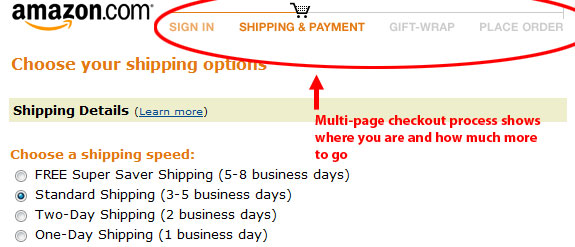

# Usability

| Objectives |
| :--- |
| Move from opinion to theory on UX topics |
| Explain how to create various calls to action |
| Explain the importance of following convention, metrics, and A/B testing for making UX decisions |

Usability or User Experience Design (UX) is an important discipline for all software developers to be familiar with. To become an expert is UX takes years of dedicated study, curation, and actual designing. However, to become familiar with a few basic UX principles will give you a language to talk about UX.

## Rules

1. **System State or Feedback** - always let users know the state of the system (e.g. loading, logged in, success, error, etc)
1. **Clear Symbols** - don't assume your users understand vague symbols
1. **Preferred Action** - Let users know what the action they are "meant" to do is.
1. **Smart Defaults and Prompts** - People pick them 60% of the time.
1. **Progressive Actions** - break up long actions into steps (e.g. registration, shopping cart, profile completion, etc)
1. **Low Barriers to Entry** - Let people do stuff in your app before committing.

## That's Just Your ... Opinion ... Man

Although when we are not trained it seems like personal preference, user experience design is **NOT A MATTER OF OPINION**. Memebers of a team that can't discuss UX design reasonably and treat UX as a matter of opinion seem unprofessional and are unhelpful. Always strive to elevate UX decisions to a discussion of objective topics such as:

1. Trends in web design
2. Project business goals
3. Achievement of key metrics
4. Experimentation

## Conventions and Trends

The web is like fashion, to look good you have to take into account conventions and trends. You can "be original" but you have to be careful or you'll be that guy with the ear cuff in the 7th grade.

## The UX Process

1. Write user stories.
1. Find inspirations in similar or competitor websites.
1. Decide on key metrics and key user actions
  - (e.g. signing up, subscribing, creating a post, posting a comment, voting, adding something to your shopping cart)
1. Draw multiple iterations of wireframes.
  - Wireframes are a huge opportunity to quickly iterate through many various layout concepts. You can change drawn wireframes 100X faster than you can update layouts in code!

## Call to Action

One fundamental prinicple in UX design is the **Call to Action**. Can you identify the calls to action on these pages?

## A Shallow vs. Deep Navigational Structure

Navigation can be flat like a pancake or deep like a well. Be aware of how you are structuring your navigation.

## Funnels

A funnel is a navigational flow towards a goal. The classic one is the amazon checkout. When making a funnel only let people navigate forward and backwards.

## Onboarding

One of the most important funnel is the registration or "onboarding" funnel. Onboarding a new user is hard to do. Some goals include:

1. Teaching the user about your site
1. Building a site culture
1. Prompting users to share
1. Prompting users to download the mobile app

Some dangers in onboarding are:

1. Users "bounce" from your site and don't sign up
1. Users give you fake email addresses or information
1. Users sign up and never come back

## User Testing

The final arbiter of UX design is the design that better achieves business goals such as signups, user engagement, purchases, donations, etc. A sophisticated way to compare UX options is to use a process called A/B testing.

There are not very many code solutions for rolling your own A/B testing. Intead use a service:

- [Optimizely](https://www.optimizely.com/)
- [VMO](https://vwo.com/)
- [Apptimize](http://apptimize.com/)

## Examples of Bad UX

- http://badux.tumblr.com/
- https://www.pinterest.com/uxfails/ux-fails/

## Examples of Good UX/UI

- [GoodUI.org](https://www.goodui.org/)
- [7 Rules for UI](https://medium.com/@erikdkennedy/7-rules-for-creating-gorgeous-ui-part-1-559d4e805cda)
- [Authentic Weather](https://www.behance.net/gallery/Authentic-Weather/7196565)

# Challenges

1. Pick three websites and wireframe their main screens structures.
 - label their calls to action
 - What might be some of their key metrics or key user actions?
1. Review 2 websites' onboarding flow with [useronboarding.com](https://www.useronboard.com/). Find a partner and share the most interesting things you saw.
1.
